<div align="center">



# doc2latex

**Fully offline converter: PDF · DOCX · JPEG · PNG → compilable LaTeX.**
Preserves text, equations, figures, and tables. No API calls, no cloud costs, no telemetry.

<p>
  <a href="https://github.com/hasnain7abbas/doc2latex/releases/latest"></a>
  <a href="https://github.com/hasnain7abbas/doc2latex/actions/workflows/release.yml"></a>
  <a href="./LICENSE"></a>
  
  
  <a href="https://github.com/hasnain7abbas/doc2latex/stargazers"></a>
</p>

<p>
  <a href="https://github.com/hasnain7abbas/doc2latex/releases/latest/download/doc2latex_0.1.0_x64_en-US.msi"></a>
  <a href="https://github.com/hasnain7abbas/doc2latex/releases/latest/download/doc2latex_0.1.0_x64-setup.exe"></a>
  <a href="https://github.com/hasnain7abbas/doc2latex/releases/latest/download/doc2latex_0.1.0_aarch64.dmg"></a>
  <a href="https://github.com/hasnain7abbas/doc2latex/releases/latest/download/doc2latex_0.1.0_amd64.deb"></a>
  <a href="https://github.com/hasnain7abbas/doc2latex/releases/latest/download/doc2latex_0.1.0_amd64.AppImage"></a>
  <a href="https://github.com/hasnain7abbas/doc2latex/releases/latest"></a>
</p>

</div>

---

## ✨ Why doc2latex

- 🔒 **100% offline.** After first-run model downloads, every byte stays on
  your machine. No API keys, no usage caps, no privacy worries.
- 📐 **Math-aware.** Equations are OCR'd with [pix2tex] / [Nougat] / [marker],
  not flattened to images.
- 🧱 **Block-faithful.** Headings, paragraphs, figures, tables, and lists
  round-trip to the equivalent LaTeX, not a wall of `\paragraph`.
- ⚡ **Streaming.** Long PDFs are processed page-by-page so memory stays
  bounded regardless of length.
- 🎛️ **Three engines, one CLI.** Pick `basic` (fast), `nougat` (academic
  PDFs), or `marker` (faster than Nougat).
- 🖥️ **Ships everywhere.** CLI on every Python platform, plus desktop
  installers and an Android APK.

[pix2tex]: https://github.com/lukas-blecher/LaTeX-OCR
[Nougat]: https://github.com/facebookresearch/nougat
[marker]: https://github.com/VikParuchuri/marker

## 📥 Download

| Platform | File | Notes |
|---|---|---|
| 🪟 **Windows** | [`.msi`][win-msi] (recommended) / [`.exe`][win-exe] | x64, bundles the CLI as a Tauri sidecar |
| 🍎 **macOS** (Apple Silicon) | [`.dmg`][mac-arm] | arm64 native, no Rosetta needed |
| 🍎 **macOS** (Intel) | `.dmg` *(building)* | Queued on `macos-13`; will land at v0.1.0 |
| 🐧 **Linux** | [`.deb`][lin-deb] / [`.AppImage`][lin-img] / [`.rpm`][lin-rpm] | amd64 |
| 🤖 **Android** | `.apk` *(in progress)* | Chaquopy-based, basic engine only |
| 🐍 **Python CLI** | `pip install -e .` | All platforms with Python 3.10–3.13 |

[win-msi]: https://github.com/hasnain7abbas/doc2latex/releases/latest/download/doc2latex_0.1.0_x64_en-US.msi
[win-exe]: https://github.com/hasnain7abbas/doc2latex/releases/latest/download/doc2latex_0.1.0_x64-setup.exe
[mac-arm]: https://github.com/hasnain7abbas/doc2latex/releases/latest/download/doc2latex_0.1.0_aarch64.dmg
[lin-deb]: https://github.com/hasnain7abbas/doc2latex/releases/latest/download/doc2latex_0.1.0_amd64.deb
[lin-img]: https://github.com/hasnain7abbas/doc2latex/releases/latest/download/doc2latex_0.1.0_amd64.AppImage
[lin-rpm]: https://github.com/hasnain7abbas/doc2latex/releases/latest/download/doc2latex-0.1.0-1.x86_64.rpm

## 📦 Install (CLI)

```bash
pip install -e .
```

Everything is included by default — OCR (`pytesseract`, `pix2tex`), table
extraction (`pdfplumber`, `camelot-py`), and the academic-PDF backends
(`nougat-ocr`, `marker-pdf`). The first run of `pix2tex` / Nougat / Marker
downloads model weights once; after that the tool is fully offline.

> **🐍 Python version note** — the heavy ML deps (`pix2tex`, `nougat-ocr`,
> `marker-pdf`, `opencv-python`, `camelot-py[cv]`) pin older transitive
> packages without Python 3.14 wheels yet. They install automatically on
> **Python 3.10–3.13** and are silently skipped on 3.14. The basic
> PDF / DOCX / pdfplumber-table path runs on 3.14; use 3.10–3.13 for
> equation OCR and the Nougat/Marker backends.

### 🛠️ System dependencies

| Tool | Purpose | macOS | Ubuntu | Windows |
|---|---|---|---|---|
| `tesseract`   | OCR for scans / images          | `brew install tesseract`         | `apt install tesseract-ocr`      | [tesseract-ocr.github.io](https://tesseract-ocr.github.io/tessdoc/Installation.html) |
| `ghostscript` | Camelot table extraction         | `brew install ghostscript`       | `apt install ghostscript`        | [ghostscript.com/releases](https://www.ghostscript.com/releases/gsdnld.html) |
| `pdflatex`    | Compile the output (for testing) | `brew install --cask mactex`     | `apt install texlive-latex-base` | [MiKTeX](https://miktex.org/download) |

## ⚡ Usage

```bash
doc2latex convert paper.pdf
doc2latex convert paper.pdf --backend nougat --out paper.tex
doc2latex convert report.docx
doc2latex convert scan.jpg --ocr-lang eng+deu
doc2latex convert equation.png --whole-equation
```

### 🧰 CLI reference

```
doc2latex convert <input> [--out out.tex] [--assets-dir assets]
                          [--backend {basic,nougat,marker}]
                          [--ocr-lang eng] [--dpi 300]
                          [--no-equations] [--no-tables]
                          [--whole-equation] [--verbose]
```

**Exit codes**

| Code | Meaning |
|---|---|
| `0` | ✅ Success |
| `2` | ⚠️ Bad input (file not found / unsupported type) |
| `3` | 🧱 Missing system dependency |
| `4` | 💥 Conversion failure |

## 🧠 Backends

| Backend | Best for | Speed | First-run download |
|---|---|---|---|
| **`basic`** *(default)* | Most documents — PDFs, Word, images | ⚡ Fast | ~250 MB (pix2tex) |
| **`nougat`** | Academic PDFs with multi-column layouts + dense equations | 🐢 Slow | ~1.4 GB |
| **`marker`** | Layout-heavy PDFs where speed matters | 🚶 Medium | ~600 MB |

All three run **locally** after the first weight download.

## 🛠️ How it works

```
input file → router → reader → [text, equation imgs, figure imgs, tables]
          → converters (per-block) → assembler → output.tex + assets/
```

Each reader emits a stream of normalized `Block` objects (`heading`, `para`,
`equation`, `figure`, `table`, `list`). The assembler renders them through a
Jinja LaTeX template. Long documents are processed page-by-page (streamed)
so memory stays bounded regardless of page count.

## 📸 Screenshots

> Drop screenshots into `assets/screenshots/` and they'll render here.
> Suggested filenames: `desktop-main.png`, `desktop-convert.png`,
> `android-main.png`, `cli-run.png`.

<div align="center">
  
  &nbsp;
  
  <br><br>
  
  &nbsp;
  
</div>

## 🐛 Troubleshooting

- **`tesseract binary not found on PATH`** — Install Tesseract (see table
  above) or pass `--no-equations` if you don't need OCR.
- **`ghostscript not found`** — Required by Camelot. Install it, or pass
  `--no-tables` to disable table extraction.
- **`pix2tex` first run is slow** — It downloads model weights (~250 MB) to
  `~/.cache/pix2tex`. After that it's offline and fast.
- **`pdflatex` errors on output** — Check that `assets/` is next to the
  `.tex` file; relative paths matter.

## 🚧 Known limitations

- Handwritten math is not supported.
- Complex two-column journal layouts work much better with `--backend nougat`.
- Merged-cell tables become rectangular grids (cell content is preserved but
  spans are flattened).
- DOCX inline equations are extracted as raw text where possible; for
  reliable rendering, ship embedded equation images and the basic path picks
  them up via pix2tex.

## 🧪 Development

```bash
pip install -e ".[dev]"
pytest -q
```

Tests that require `tesseract` or `ghostscript` are skipped automatically
when the binaries aren't available.

## 🖥️ Desktop & mobile builds

doc2latex ships a Tauri v2 desktop GUI and a Chaquopy-based Android app.
GitHub Actions builds installers on every push to `main`.

### What gets built

| Platform | Artefact | How |
|---|---|---|
| 🪟 **Windows**   | `.msi` + `.exe` (NSIS)   | Tauri + PyInstaller sidecar |
| 🍎 **macOS** (arm64 + x86_64) | `.dmg`         | Tauri + PyInstaller sidecar |
| 🐧 **Linux** (Ubuntu 22.04)   | `.deb` + `.AppImage` + `.rpm` | Tauri + PyInstaller sidecar |
| 🤖 **Android**   | `.apk` (basic engine only) | Gradle + Chaquopy            |

The desktop installers bundle a frozen `doc2latex` binary via PyInstaller
(`packaging/doc2latex.spec` + `packaging/build_sidecar.py`) and ship it as a
Tauri sidecar — users never need Python installed.

The Android APK uses **Chaquopy** to embed CPython 3.11 plus the pure-Python
deps that have ARM wheels (`python-docx`, `pymupdf`, `pdfplumber`, `Pillow`).
The mobile build does **not** include `pix2tex`, `opencv`, `nougat-ocr`,
`marker-pdf`, or `camelot` — those don't fit or don't build for Android.
DOCX → LaTeX and text-only PDF → LaTeX work; equation OCR and the
Nougat / Marker backends are desktop-only.

### Local builds

```bash
# Sidecar binary (places it under src-tauri/binaries/)
python packaging/build_sidecar.py

# Run the GUI in dev mode
bun install
bun run tauri dev

# Bundle installers for the host platform
bun run tauri build
```

```bash
# Android (requires Android SDK + JDK 17)
cd android-app
./gradlew :app:assembleDebug
# APK at app/build/outputs/apk/debug/
```

## 🚀 Releasing

`.github/workflows/release.yml` follows an auto-bump pattern:

1. 📤 Push to `main`.
2. 🔢 CI bumps the patch in `tauri.conf.json`, `package.json`,
   `src-tauri/Cargo.toml`, `pyproject.toml`, and
   `android-app/app/build.gradle.kts` (all in one `[skip ci]` commit).
3. 🏗️ Matrix builds Tauri installers on Windows / macOS arm64 / macOS x86_64
   / Ubuntu 22.04.
4. 🤖 A parallel job builds the Android APK via Gradle.
5. 📦 `tauri-action` and `softprops/action-gh-release` upload everything to
   the same GitHub Release tagged `vX.Y.Z`.

No secrets needed — `GITHUB_TOKEN` is provided automatically. The Android
APK ships debug-signed (via `assembleDebug`) so it's installable on real
devices without extra setup. For a properly-signed release build, generate
a keystore, store it + its password as repo secrets, and swap the
"Build debug-signed APK" step for `assembleRelease` with a signing config.

## 📄 License

[MIT](./LICENSE)

<div align="center">
<sub>Made for researchers, students, and anyone allergic to vendor lock-in.</sub>
</div>
